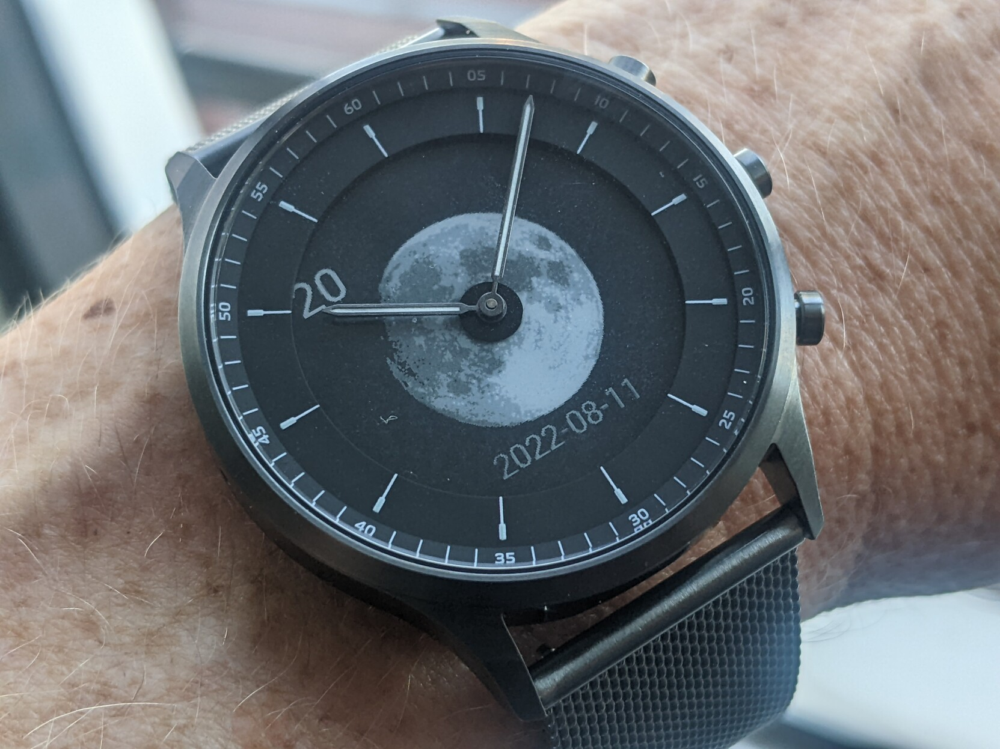
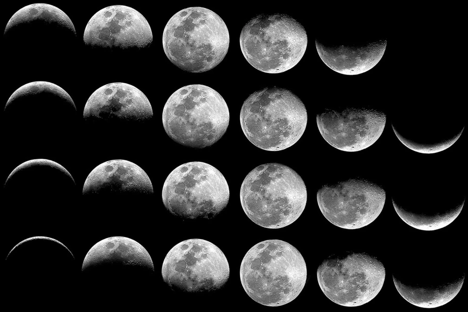

# Moonphase and 24-hour clock



This is an application to demonstrate a simple watch face with image drawing.

You will need to have built and installed `jerryscript-2.1.0` as well as the `Fossil-HR-SDK`.



```
convert \
	moonphases.png \
	-crop 160x160 \
	-set filename:tile \
	"%[fx:page.x/160]_%[fx:page.y/160*-1+3]" \
	+repage \
	-rotate 90 \
	PNG32:"images/moon-%[filename:tile].png"
```


