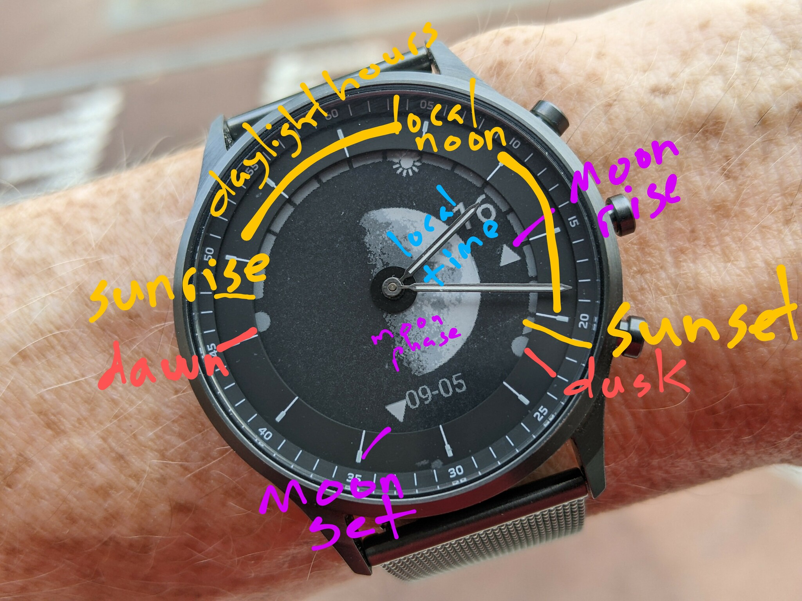

# Moonphase and 24-hour clock



This is an application to demonstrate a moderately complicated watch face with image drawing
and some practical functions.

The watch shows several celestial datapoints:

* the hour hand rotates once per day, with noon at the top
* the current hour is prominently displayed near the hour hand
* the current phase of the moon is large in the center
* the local sunrise and sunset times are marked with small circles
* the local solar noon has a small sun icon
* the daylight hours have an arc along the outside
* there are grid bars every to help estimate daylight remaining
* the upcoming moon rise and set times are marked with small icons

If you do a quick wrist flip it will animate all of the moon phases.


## Building

You will need to have built and installed [`jerryscript-2.1.0`](https://github.com/jerryscript-project/jerryscript/releases/tag/v2.1.0) (newer versions don't work?),
preferably with options to enable line-number errors when compiling
(otherwise it only outputs "`Syntax error`" with no information about
where).

```
python3 tools/build.py \
  --snapshot-exec=on \
  --jerry-cmdline-snapshot=on \
  --profile=es5.1 \
  --error-messages=on \
  --line-info=on \
  --logging=on
```

You as well as the [Fossil-HR-SDK](https://github.com/dakhnod/Fossil-HR-SDK/blob/main/DOCUMENTATION.md),
which has the tools to build and pack the `wapp` files to install via [GadgetBridge](https://gadgetbridge.org/).  As of 2022-08-12, the gen6 support is not yet in mainline, so you will need to build
with [PR#2775](https://codeberg.org/Freeyourgadget/Gadgetbridge/pulls/2775) to detect the newer watches.


## Images


```
convert \
	moonphases.png \
	-crop 160x160 \
	-set filename:tile \
	"%[fx:page.x/160]_%[fx:page.y/160*-1+3]" \
	+repage \
	-rotate 90 \
	PNG32:"images/moon-%[filename:tile].png"
```

## Celestial math

The sunrise / sunset and moon rise / set / phase calculations are using [suncalc.js](https://github.com/mourner/suncalc), modified to not use any of the Javascript `Date` class, since the SDK doesn't include it.

## Notes

If you want to reset the watch, hold down the middle button until it vibrates.
**Do *NOT* select "Reset and disconnect"**; it will erase the watch menu and you'll have to re-pair with the factory app

The moon rise / set icons are not very good.  It would be nice to also have the moon heading.
